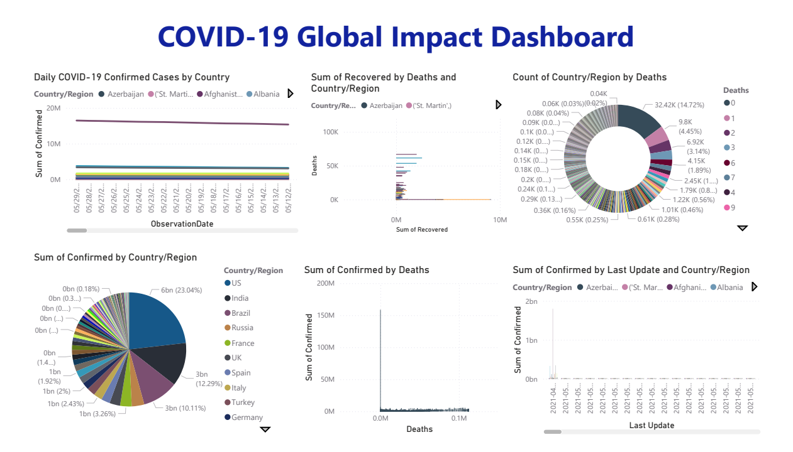

# 🦠 COVID-19 Global Data Analytics Dashboard

[](https://powerbi.microsoft.com/)
[](https://python.org)
[]()
[](https://github.com/adyashaaa28/Covid-19-Analytics)

---

## 📌 Overview

This project presents a visual and analytical exploration of COVID-19 trends across the globe using **Power BI** and **Python**. The aim is to derive insights from real-time COVID-19 data using interactive charts, maps, and plots.

The dashboard includes:
- Daily trends in confirmed, recovered, and death cases
- Pie chart showing case distribution
- Line and scatter plots for country-wise comparisons
- Data filters to explore specific time periods or regions

---

## 📊 Power BI Dashboard Preview



*Image: COVID-19 Global Dashboard created in Power BI*

---

## 🧪 Tools & Technologies

| Tool | Purpose |
|------|---------|
| **Python (pandas, matplotlib)** | Data cleaning and preparation |
| **Power BI** | Visual dashboard and analytics |
| **Git + GitHub** | Version control and project hosting |

---


---

## 📥 Data Source

Dataset: [Our World in Data COVID-19 Dataset](https://github.com/owid/covid-19-data)

---

## 🚀 How to Run

### Option 1: Explore Power BI Dashboard
1. Open Power BI Desktop
2. Load the `covid_19_data.csv` file
3. View or customize the dashboard using the fields and filters

### Option 2: Run Python Preprocessing (if used)
```bash
python scripts/data_cleaning.py

